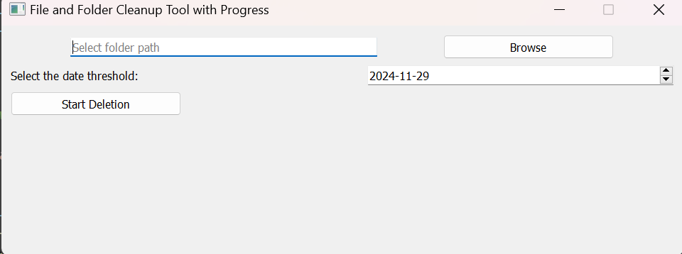
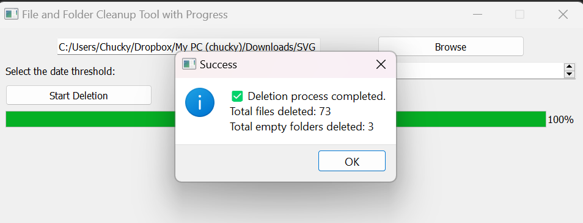

# File and Folder Cleanup Tool with Progress

This is a Python application that allows users to delete files and folders older than a specified date from a selected directory. The application uses PyQt5 for the graphical user interface.

## Features

- Select a folder to scan for files and folders.
- Choose a date threshold to delete files and folders older than the specified date.
- Progress bar to show the deletion progress.
- Option to cancel the deletion process mid-way.
- Displays the number of files and folders deleted upon completion.

## Requirements

- Python 3.8x
- PyQt5

## Installation

1. Clone the repository:

    ```sh
    git clone https://github.com/bozicschucky/easy_delete.git
    cd easy_delete
    ```

2. Create a virtual environment and activate it:

    ```sh
    python -m venv .venv
    .venv\Scripts\activate  # On Windows
    # source .venv/bin/activate  # On macOS/Linux
    ```

3. Install the required packages:

    ```sh
    pip install PyQt5
    ```

## Usage

1. Run the application:

    ```sh
    python easy_delete.py
    ```

2. Use the "Browse" button to select the folder you want to scan.
3. Select the date threshold using the date picker.
4. Click the "Start Deletion" button to begin the deletion process.
5. You can cancel the deletion process at any time by clicking the "Cancel" button.

## Screenshots

### Screenshot 1


### Progress Bar


## Code Overview

### Main Application

The main application is implemented in the `CleanupTool` class, which inherits from `QMainWindow`. The UI is created using PyQt5 widgets.

### Functions

- `count_files_and_folders(folder_path)`: Counts the total number of files and folders in the specified directory.
- `delete_files_and_folders_with_progress(window, folder_path, date_threshold, progress_bar, status_label)`: Deletes files and folders older than the specified date and updates the progress bar and status label.

### Methods

- `browse_folder()`: Opens a file dialog to select a folder.
- `start_deletion()`: Starts the deletion process based on the selected folder and date threshold.
- `cancel_deletion()`: Cancels the deletion process.

## License

This project is licensed under the MIT License. See the [LICENSE](LICENSE) file for details.

## Acknowledgements

- [PyQt5 Documentation](https://www.riverbankcomputing.com/static/Docs/PyQt5/)